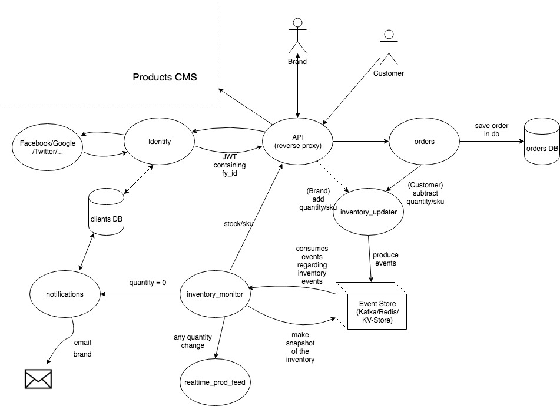

# Fy Inventory Design

## Short description
To keep track of the stock changes in a `realtime` manner,  I chose to design an `Event Sourcing` solution.
Brands (artists included) and customers would communicate 
 - with an API (reverse proxy) that would identify the client via the Authentication service like Google/Facebook/Twitter and check in the clients table the fy_id (unique identifier for a client) and its role(which brand/ customer)
 - The Customer can only access orders service (to place an order)
    - An order is composed of the brands id, SKUs and the quantity specific to it and is saved in the DB
    - Once the order is placed, the quantity of those SKUs is decreased by calling the inventory-updater using a structure like: 
        ```
        {
            “SKU”: “ab_20x20_white”,
            “deltaQuantity”: -2 
        }
        ```

 - The Brand can access the inventory-updater ,inventory-monitor and orders service
    - To add stock for an SKU, the brand will make a request to the inventory-updater where he would provide the SKU and the delta stock for that item, eg.
		```
		{
            “SKU”: “ab_20x20_white”,
            “deltaQuantity”: 2 
		}
        ```
    - To get the live quantity for an SKU, he would call the inventory-monitor and would get a response like 
		```
		{
        “SKU”: “ab_20x20_white”,
                “quantity”: 100
        }
        ```
    - To update an order he would make a request to the orders service with a payload like
		```
		{
		“orderId”: 834523
        “status”: “shipped”
        }
        ```
    - To notify the return of an item, the request will access the orders service and set the status for an sku in the order to `return`
        ```
        {
            “orderId”: 834523,
        “SKU”: “ab_20x20_white”
        }
        ```
 - The `Event Store` hold 2 tables (eg. kafka topics)
    - Inventory_events
      - Would contain events like: 
        ```
        {
		“SKU”: “ab_20x20_white”,
		“deltaQuantity”: 2 
		}
		```
    - Inventory_snapsots
      - Would keep snapshots for each SKU
	    ```
        {
         “time” : “12:00 12/10/2018“,
         “SKU”: “ab_20x20_white”,
         “quantity”: 100,
         “Checkpoint”: …,
          ...
        }
        ```

 - The inventory-monitor 
    - It aggregates the events from the `Event Store` - Inventory_events and keeps track of the stock of each SKU
    - periodically it saves a snapshot (+checkpoint) of each sku in the `Event Store` - Inventory_snapshots 
 - The notifications service
    - gets notified of SKUs with no stock
    - queries the clients db to find the brand’s email  for that SKU
    - sends the email to the customer

## Assumptions
 - The stock of an item is decreased when a customer orders an item and not when the brand confirms the order
 - An item being shipped or returned doesn’t impact the stock
 - If an item is returned the brand will have to notify us “a new stock for product”
 - All the “new stock for a product” events contains the delta compared with the previous value
 - SKUs are unique between brands, if not, the brands id would be prepended to theirs sku

## Diagram



## Deploy & testing
 - I would use a CI/CD flow from GitLab
    - push code -> build -> unit test -> integration test -> deploy on staging
 - I would deploy it as jars or docker containers
    - if I would deploy it as jars, then I would supervise the processes with runit or other service supervisors.
    - if container, I would pay extra attention with the amount of memory the container would use.
 - because most of the logic is around the `Event Store` (eg. Kafka) I would focus on integration tests for the  inventory-monitor, inventory-updater
 - I would use `midje` or `clojure test`
 
## Project structure
 - I would split the application into small services as presented on the diagram, but for the sake of brevity I present it hear as a single app which can be split over time.
  
